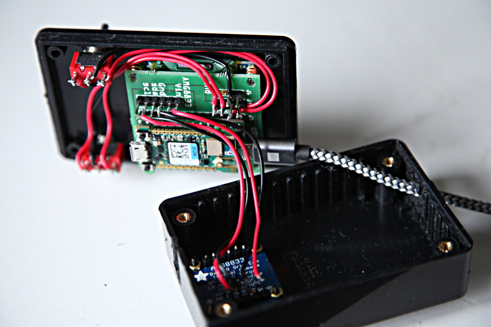
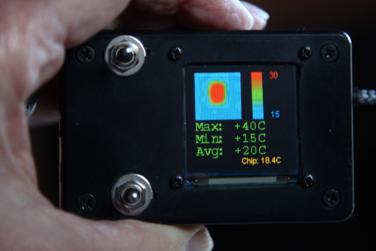
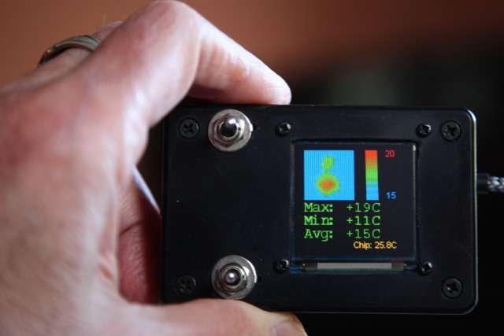

# micropython-amg88xx
Driver for Grid-EYE 8x8 pixel thermal infra red array sensor (Adafruit 3538).

Now provides optional bicubic interpolation for camera displays.

The driver is a port of the
[Adafruit CircuitPython driver](https://github.com/adafruit/Adafruit_CircuitPython_AMG88xx)
modified for MicroPython.

Original author(s): Dean Miller, Scott Shawcroft.  
Adapted by Peter Hinch. Dependencies on Adafruit libraries removed, coding
adapted to conform to MicroPython conventions. Extended to provide additional
functionality.

A typical camera build:  
  
Interpolated images (a cup of coffee):  
  
My chair a while after I had got up:  
  

The update rate with bicubic interpolation is just over 3Hz.

# 1. Files

 * `amg88xx.py` The device driver.
 * `amg_test.py` Simple text based test program.

For thermal camera use:
 * `cam.py` Thermal camera demo for Adafruit 0.96 inch OLED display.
 * `cam_lcd.py` Thermal camera demo for official LCD160CR display.
 * `mapper.py` Provides a class to convert temperature values to rgb colors.
 Required for both demos.
 * `ssd1331.py` Driver for
 [Adafruit 0.96 OLED display](https://www.adafruit.com/product/684).

The Adafruit OLED display driver is from
[this repo](https://github.com/peterhinch/micropython-nano-gui.git)
which also has drivers for their larger displays based on the SSD1351 chip.
The repo has optional drivers supporting 16 bit color: these trade improved
color against a larger frame buffer, and so are best suited to platforms
with plenty of RAM.

The driver for the official LCD160CR is included in Pyboard firmware. Source is
[here](https://github.com/micropython/micropython/blob/master/drivers/display/lcd160cr.py).

The `my_cam` directory contains a complete set of files for my camera project.

## 1.1 Interpolation

In camera applications the 8x8 matrix of the AMG8833 gives a "blocky" effect.
This can be reduced by using bicubic interpolation. Files and
[doc](./interpolate/README.md) for this are in the `interpolate` directory.

# 2. Wiring

If used with a Pyboard

| pyboard | amg8833 |
|:-------:|:-------:|
| 3V3     | VIN     |
| GND     | GND     |
| SCL X9  | SCL     |
| SDA X10 | SDA     |

# 3. AMG88XX class

This maintains an internal `bytearray` object holding a single frame of raw
data from the sensor. It is populated by the `refresh` method. The contents may
be retrieved as integer temperatures in °C by means of array access syntax.

Constructor:  
This takes the following arguments:
 * `i2c` An `I2C` instance created using the `machine` module.
 * `address=0x69` The default device address. If you solder the jumper on the
 back of the board labeled `Addr`, the address will change to 0x68.

Data access methods:
 * `refresh` Takes an optional arg which is ignored. This method causes the
 internal array to be updated with data from the sensor. On a Pyboard 1.x this
 method blocks for 2.9ms. This method does not allocate RAM and may be called
 by an interrupt service routine. The dummy arg facilitiates use as a timer
 callback (see commented out code in `cam.py`).
 * `__getitem__` Args `row`, `col`. Enables access to the data retrieved by
 `refresh`. Return value is a signed integer representing the temperature of
 that pixel in °C (or °C x 4 in high resolution mode).
 * `temperature` No args. Returns the device temperature in °C as a float.

Mode setting methods:
 * `hi_res=None` By default pixel temperatures are returned in °C. If `True` is
 passed, future readings will be in 0.25°C increments. This is the fundamental
 resolution of the chip, although its absolute accuracy is +-2.5°C. If `False`
 is passed, future readings will be in °C. By default no change is made. In all
 cases the method returns `True` if in high resolution mode.
 * `ma_mode=None` If `True` is passed the chip operates in moving average mode.
 This reduces noise at the expense of response speed. If `False` is passed,
 moving average mode is cancelled. By default no change is made. In all cases
 the current mode is returned.

Example usage:  
After issuing the `refresh` method, a set of pixel data may be read by means of
array access.

```python
import machine
import utime
from amg88xx import AMG88XX

i2c = machine.I2C(1)
sensor = AMG88XX(i2c)
while True:
    utime.sleep(0.2)
    sensor.refresh()
    for row in range(8):
        print()
        for col in range(8):
            print('{:4d}'.format(sensor[row, col]), end='')
```

# 4. Camera demo cam.py

This assumes a Pyboard linked to an
[Adafruit 0.96 OLED display](https://www.adafruit.com/product/684). Wiring is
as follows:

| pyboard | OLED |
|:-------:|:----:|
| 3V3     | VCC  |
| GND     | GND  |
| X8 MOSI | SDA  |
| X6 SCL  | SCL  |
| X3      | RES  |
| X2      | CS   |
| X1      | DC   |

The sensor is wired as in [section 2](./README.md#2-wiring).

Orientation of the display may be adjusted to match the physical layout of the
devices by setting the following program booleans:
 * `invert` Swap top and bottom.
 * `reflect` Swap left and right.
 * `transpose` Exchange row and column.

The limits of temperature display may be adjusted by assigning integer values
to these program values:
 * `TMAX` Temperatures >= `TMAX` appear red.
 * `TMIN` Temperatures <= `TMIN` appear blue.

# 5 Camera demo cam_lcd.py

As written this assumes a Pyboard 1.x with the LCD fitted in the 'Y' position
and the sensor wired as in [section 2](./README.md#2-wiring).

Orientation of the display may be adjusted to match the physical layout of the
devices by setting the following program booleans:
 * `invert` Swap top and bottom.
 * `reflect` Swap left and right.
 * `transpose` Exchange row and column.

The limits of temperature display may be adjusted by assigning integer values
to these program values:
 * `TMAX` Temperatures >= `TMAX` appear red.
 * `TMIN` Temperatures <= `TMIN` appear blue.

# 6. Mapper class for cameras

This simple class converts a temperature in °C to 8 bit rgb color values
compatible with most display drivers. Conversion uses a predefined mapping with
blue for low temperatures through green to red, with constant overall
brightness. Out of range temperature values are clipped to the maximum or
minimum as required. The range covered may be dynamically altered.

Constructor  
This takes the following args:
 * `tmin` Minimum temperature to represent (°C).
 * `tmax` Maximum temperature to represent (°C).
 * `ncolors=30` Number of color gradations.

Methods:
 * `set_range(tmin, tmax)` Allows the temperature range to be altered
 dynamically.
 * `__call__(t)` Function call syntax takes a temperature in °C and returns
 `(r, g, b)`. Red, green and blue values are in range 0..255.
